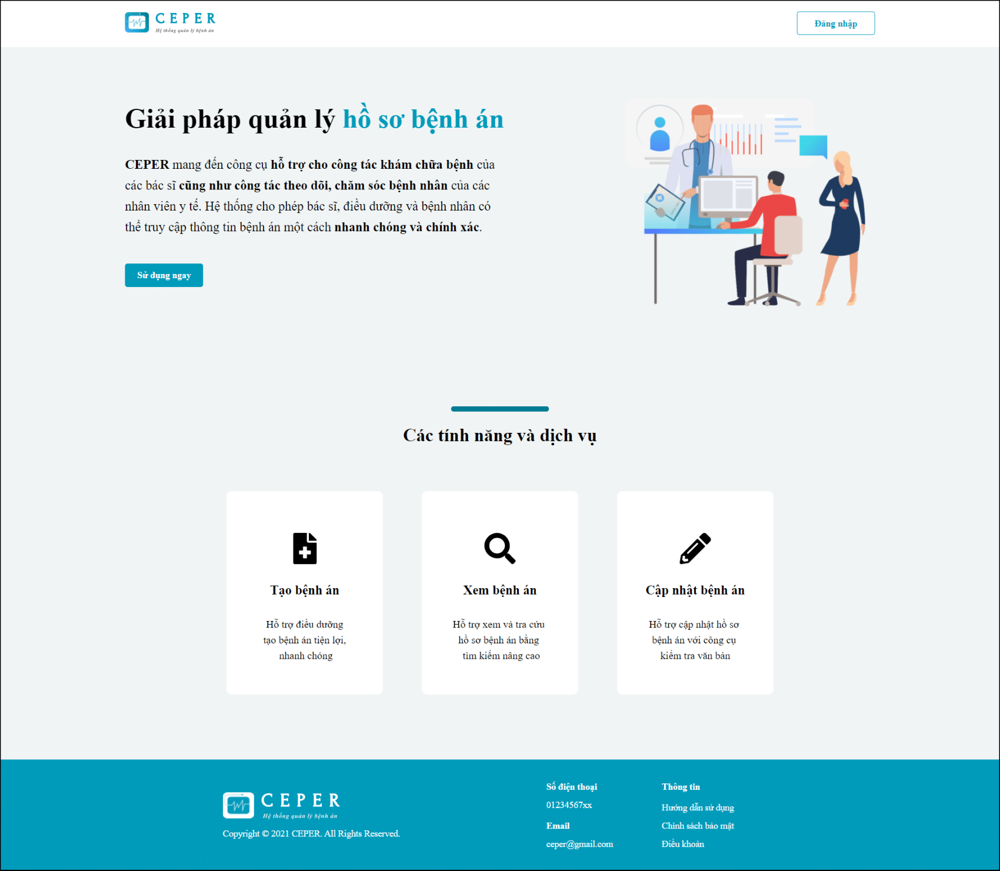

# CEPER
> Vietnamese Electronic Medical Record Management

Implementation for thesis topic **"Developing a clinical text preprocessing system for medical records"** of 2 HCMUT's students.

## General info
Our team propose a Vietnamese electronic medical record management system with spelling error correction on clinical texts. Firstly, our system provides some key users such as doctors, nurses, and patients with convenient effective EMR manipulations in either interactive or automatic mode. Secondly, a spelling error correction method (defined in a novel hybrid manner by effectively combining a rule-based approach, dictionaries, n-grams, and BARTpho, a pre-trained monolingual sequence-to-sequence model) can cover a wide diversity of spelling errors, especially multiword errors.

## Technologies
Project is created with:
* Front-end: ReactJS v17.0.2
* Back-end: Python v3.10.4, Flask v2.1.1
* Database: MySQL v8.0.28

## Team
| 
Khang Tran
 | 
Anh Nguyen
 |
| :---: | :---: | 
|  |  |
| <a href="http://github.com/Kan0306" target="_blank">`github.com/Kan0306`</a> | <a href="http://github.com/anhnguyen6529" target="_blank">`github.com/anhnguyen6529`</a> |

## Screenshots

